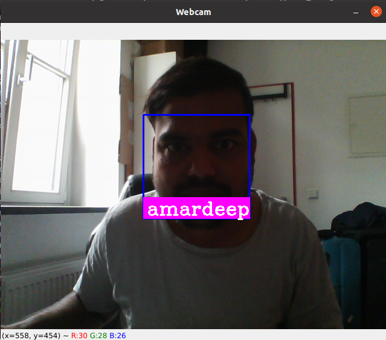

# Attendance Project using face recognition library

## Description:
The program starts by reading the training list of images. Next, the encoding of the images is figured out using the face recognition library and then the encoding is used for similarity detection. Finally, when the similarity is found, the name is read to an attendance CSV file.

## Dataset:
Images of my collogues in the SPICED Academy Cohort.

## webcam detecting the face with actual name
 

## Badges

  
## Usage

run the below command in the terminal:

python face_reg.py

  
## Tech Stack
- Dlib + Cmake
- Face Recognition Library 
- OpenCV
- NumPy
- VS Code
  
## License

Free software: [MIT](https://choosealicense.com/licenses/mit/)
License
  
## Acknowledgements

 - [Article helps to understand face recognition steps](https://medium.com/@ageitgey/machine-learning-is-fun-part-4-modern-face-recognition-with-deep-learning-c3cffc121d78)
 
  
